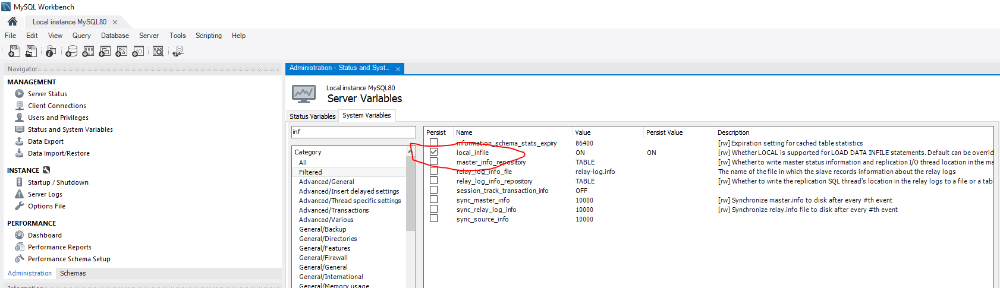

# UserManagement
//test

eSanjeevani-Registration-Module
SET GLOBAL local_infile = true;
By doing below steps on server side
Administration-->Server--->Status and system variable--->system variable-->Local Infile-->true
refer below image for above step
